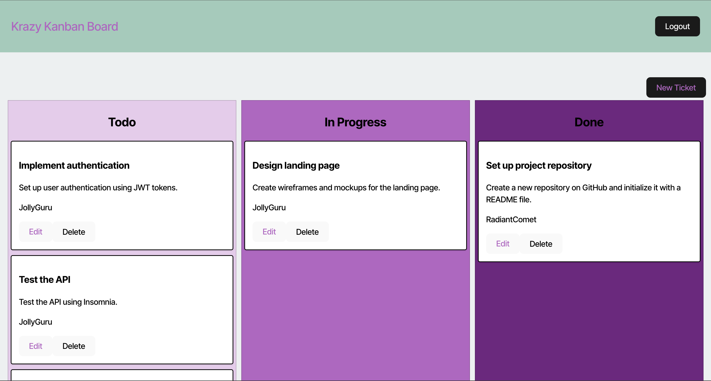

# Kanban-Board

[](https://opensource.org/licenses/MIT)

## Description
The Kanban-Board is a full-stack web application designed to help agile teams manage their work tasks efficiently. It features a secure login system using JSON Web Tokens (JWT) for authentication, ensuring that only authorized users can access and manage tasks.

## Features
- Secure login and authentication using JWT
- Task management with a Kanban board interface
- Persistent storage of tasks
- User-friendly interface

## Table of Contents
- [Installation](#installation)
- [Usage](#usage)
- [Contributing](#contributing)
- [License](#license)
- [Questions](#questions)

## Installation
1. **Clone the repository**:
    ```sh
    git clone https://github.com/AshB88/Kanban-Board.git
    ```
2. **Navigate to the project directory**:
    ```sh
    cd Kanban-Board
    ```
3. **Install the dependencies**:
    ```sh
    npm install
    ```
4. **Start the development server**:
    ```sh
    npm run start:dev
    ```
5. **Open your browser and navigate to the prompted URL to view the application**.

## Usage

1. **Login**:
    - Navigate to the login page and enter one of these provided user credentials:  
        * username: JollyGuru password: password
        * username: SunnyScribe password: password
        * username: RadiantComet password: password
    - Upon successful login, you will be redirected to the main Kanban board page.
2. **Manage Tasks**:
    - Add, edit, and delete tasks on the Kanban board.
3. **Logout**:
    - Click the logout button to securely log out and remove the JWT from local storage.

**Screenshots**:




**Deployed application**:
The application is deployed on Render and can be accessed at the following URL:  
* https://kanban-board-w2y7.onrender.com/


## Contributing
Contributions are welcome! If you would like to contribute to this project, please follow these steps:

  1. Fork the repository.
  2. Create a new branch (`git checkout -b feature/YourFeature`).
  3. Make your changes and commit them (`git commit -m 'Add some feature'`).
  4. Push to the branch (`git push origin feature/YourFeature`).
  5. Open a pull request to the `main` branch of the original repository.

## License
This project is licensed under the [MIT](https://opensource.org/licenses/MIT) license.

## Questions
For any inquiries or feedback, please contact me at:
- **Email**: ashleighb.jjd@gmail.com
- **LinkedIn**: [Ashleigh Brown](https://www.linkedin.com/in/ashleigh-brown-42981834a/)
- **GitHub**: [AshB88](https://github.com/AshB88)

## Acknowledgements

This project was made possible with the help of various resources and contributions. Some of the code was sourced from the instructor-provided files, and additional assistance was provided by GitHub Copilot. Special thanks to the following:

- **Instructor**: For providing the initial project files and guidance.
- **GitHub Copilot**: For offering code suggestions and improvements throughout the development process.